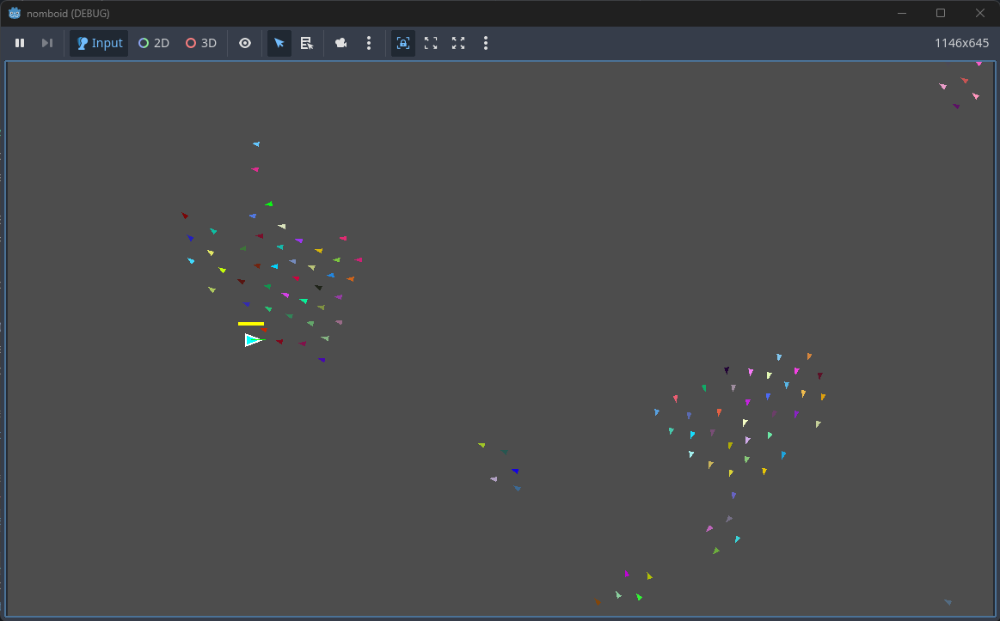

# nomboid

My first `~vibe coded~` project about a shark eating boids based on a game concept conversation with a friend (and collaborator? 🙃)

## Getting Started

1. Download [the source code](https://github.com/thehappycheese/nomboid/archive/refs/heads/main.zip) zip from this repo
2. Download Godot https://godotengine.org/download/windows/ (Just "Godot Engine", no need for the C# version)
3. Open `Godot_v4.~~~-stable_win64.exe` and import the extracted source code folder
4. Click Play 😁
